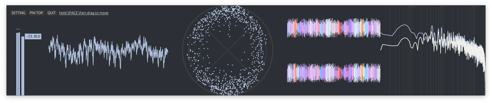
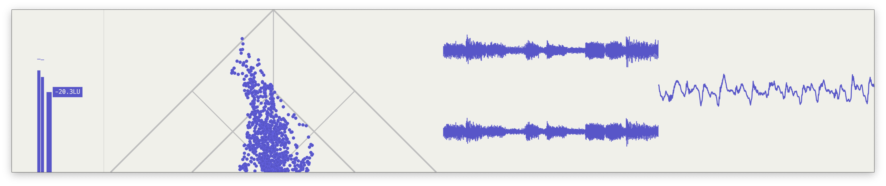
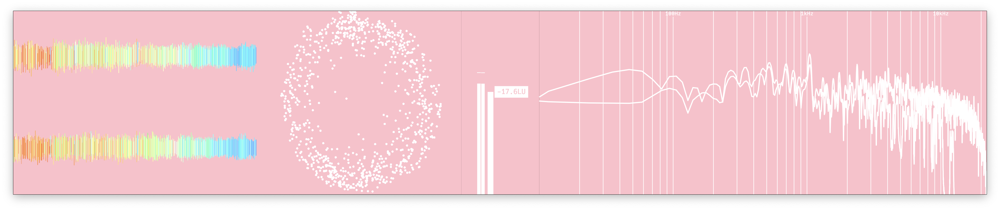
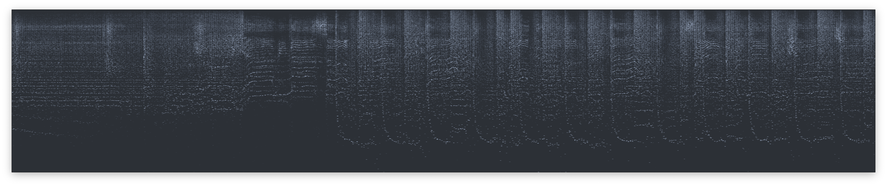
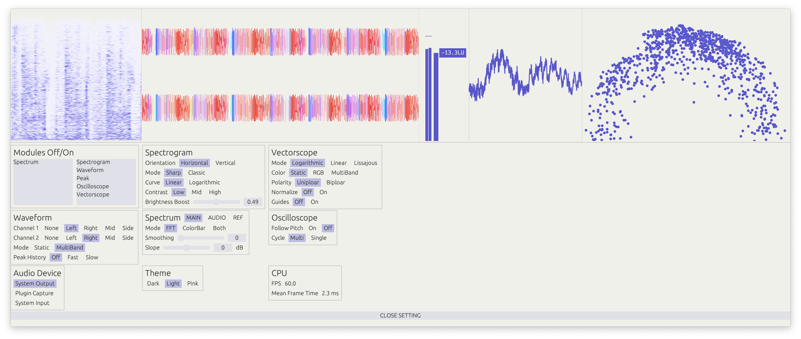
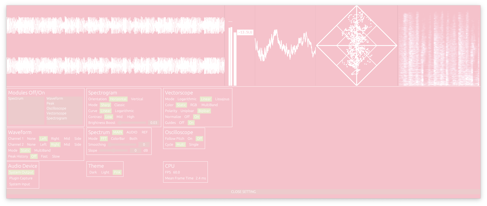

  <picture>
    
  </picture>

# NanoMeters

Crossplatform audio visualizer with Rust.

Aim for CPU/GPU/Memory friendly.

A practice that mimics but not to replace the Minimeters.

**⚠️ Under development. Unstable. Not responsible for loss of project files due to plugin or system crashes.**

Use together with [nanometers-plugin](https://github.com/aizcutei/nanometers_plug) (VST3 & CLAP) and [nanometers-au](https://github.com/aizcutei/nanometers_au) (AU is in plan).

---
## Preview

More:

---
## Audio routing support

||Audio Input/Microphone|Desktop Audio Capture|[NanometersServer Plugin](https://github.com/aizcutei/nanometers_plug)|
|-|-|-|-|
|Windows|🚧|✅ * Not compatible with ASIO drivers|✅|
|macOS|🚧|✅ * macOS 13.0 Ventura or later only|✅ * only VST3 & CLAP|
|Linux|🚧|✅ * No test yet|✅ * No test yet|

---

### Self build

You should have Rust installed. If not, install it from [here](https://www.rust-lang.org/tools/install).

Clone the repository:

`git clone`

Build the project:

`cargo build --release`

### Testing locally

Make sure you are using the latest version of stable rust by running `rustup update`.

`cargo run --release`

On Linux you need to first run:

`sudo apt-get install libxcb-render0-dev libxcb-shape0-dev libxcb-xfixes0-dev libxkbcommon-dev libssl-dev`

On Fedora Rawhide you need to run:

`dnf install clang clang-devel clang-tools-extra libxkbcommon-devel pkg-config openssl-devel libxcb-devel gtk3-devel atk fontconfig-devel`
